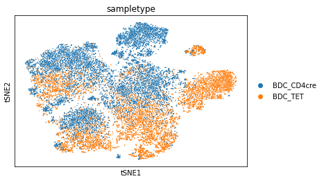
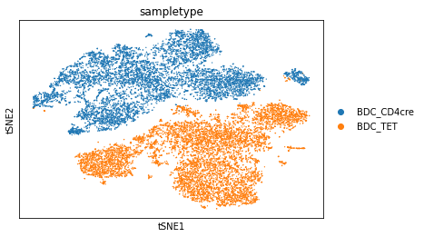
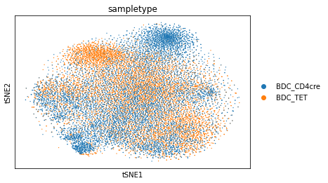

```python
import numpy as np
import pandas as pd
import scanpy as sc
import re
import matplotlib.pyplot as plt
import scanorama

```


```python
sc.settings.verbosity = 3
```

# Batch effect corrections


```python
rload = sc.read_h5ad("./scdata_merged.h5ad")
rload_combat = sc.read_h5ad("./scdata_merged.h5ad")
rload_scanorama = sc.read_h5ad("./scdata_merged.h5ad")
```


```python
#Scanorama correction
rload_scanorama.obs.sampletype = rload_scanorama.obs.sampletype.astype('category')
batches = rload_scanorama.obs['sampletype'].cat.categories.tolist()
rload_dict = {}
for batch in batches:
    print(batch)
    rload_dict[batch] = rload_scanorama[rload_scanorama.obs['sampletype'] == batch,]

#convert to list of AnnData objects
rload_scanorama_list = list(rload_dict.values())

# run scanorama.integrate
scanorama.integrate_scanpy(rload_scanorama_list, dimred = 20)

```

    BDC_CD4cre
    BDC_TET
    Found 19921 genes among all datasets
    [[0.         0.48809661]
     [0.         0.        ]]
    Processing datasets (0, 1)


```python
# Get all the integrated matrices.
scanorama_int = [ad.obsm['X_scanorama'] for ad in rload_scanorama_list]

# make into one matrix.
all_s = np.concatenate(scanorama_int)
print(all_s.shape)

# add to the AnnData object
rload_scanorama.obsm["Scanorama"] = all_s
```

    (17804, 20)


```python
# tsne and umap
sc.pp.highly_variable_genes(rload_combat)
sc.pp.pca(rload_combat, n_comps= 30,  use_highly_variable=True, svd_solver='arpack')
sc.pp.neighbors(rload_scanorama, n_pcs =30, use_rep = "Scanorama")
sc.tl.umap(rload_scanorama)
sc.tl.tsne(rload_scanorama, n_pcs = 30, use_rep = "Scanorama")
```

    extracting highly variable genes
        finished (0:00:06)
    --> added
        'highly_variable', boolean vector (adata.var)
        'means', float vector (adata.var)
        'dispersions', float vector (adata.var)
        'dispersions_norm', float vector (adata.var)
    computing PCA
        on highly variable genes
        with n_comps=30
        finished (0:00:22)
    computing neighbors
        finished: added to `.uns['neighbors']`
        `.obsp['distances']`, distances for each pair of neighbors
        `.obsp['connectivities']`, weighted adjacency matrix (0:00:01)
    computing UMAP
        finished: added
        'X_umap', UMAP coordinates (adata.obsm) (0:00:08)
    computing tSNE
        using sklearn.manifold.TSNE
        finished: added
        'X_tsne', tSNE coordinates (adata.obsm) (0:01:01)


```python
sc.pl.tsne(rload_scanorama, color='sampletype', wspace=0.5, save = "_scanorama")


```

    WARNING: saving figure to file figures/tsne_scanorama.pdf


    

    


```python
#Combat correction
sc.pp.combat(rload_combat, key='sampletype')


```

    ... storing 'orig.ident' as categorical
    ... storing 'sampletype' as categorical
    ... storing 'condition' as categorical


    Standardizing Data across genes.
    
    Found 2 batches
    
    Found 0 numerical variables:
    	
    
    Found 1071 genes with zero variance.
    Fitting L/S model and finding priors
    
    Finding parametric adjustments
    


    /Users/patri/Applications/miniconda3/lib/python3.7/site-packages/scanpy/preprocessing/_combat.py:340: RuntimeWarning: invalid value encountered in true_divide
      (abs(g_new - g_old) / g_old).max(), (abs(d_new - d_old) / d_old).max()
    /Users/patri/Applications/miniconda3/lib/python3.7/site-packages/scanpy/preprocessing/_combat.py:340: RuntimeWarning: divide by zero encountered in true_divide
      (abs(g_new - g_old) / g_old).max(), (abs(d_new - d_old) / d_old).max()


    Adjusting data
    


```python
#Normalize and apply reductions
sc.pp.highly_variable_genes(rload_combat)
sc.pp.pca(rload_combat, n_comps= 30,  use_highly_variable=True, svd_solver='arpack')
sc.pp.neighbors(rload_combat, n_pcs =30)
sc.tl.umap(rload_combat)
sc.tl.tsne(rload_combat, n_pcs = 30)

```

    extracting highly variable genes
        finished (0:00:06)
    --> added
        'highly_variable', boolean vector (adata.var)
        'means', float vector (adata.var)
        'dispersions', float vector (adata.var)
        'dispersions_norm', float vector (adata.var)
    computing PCA
        on highly variable genes
        with n_comps=30
        finished (0:00:23)
    computing neighbors
        using 'X_pca' with n_pcs = 30
        finished: added to `.uns['neighbors']`
        `.obsp['distances']`, distances for each pair of neighbors
        `.obsp['connectivities']`, weighted adjacency matrix (0:00:02)
    computing UMAP
        finished: added
        'X_umap', UMAP coordinates (adata.obsm) (0:00:09)
    computing tSNE
        using 'X_pca' with n_pcs = 30
        using sklearn.manifold.TSNE
        finished: added
        'X_tsne', tSNE coordinates (adata.obsm) (0:01:29)


```python
#Plots of the different reductions aswell and control
sc.pl.tsne(rload, color='sampletype', wspace=0.5)
sc.pl.tsne(rload_combat, color='sampletype', wspace=0.5, save = "_combat")
sc.pl.tsne(rload_scanorama, color='sampletype', wspace=0.5, save = "_scanorama")


```


    

    


    WARNING: saving figure to file figures/tsne_combat.pdf


    

    


    WARNING: saving figure to file figures/tsne_scanorama.pdf


    

    


```python
#Save data for R 
rload.write_h5ad("scdata_merged2.h5ad")
rload_combat.write_h5ad("scdata_merged_combat.h5ad")
rload_scanorama.write_h5ad("scdata_merged_scanorama.h5ad")
```


```python

```


```python

```
